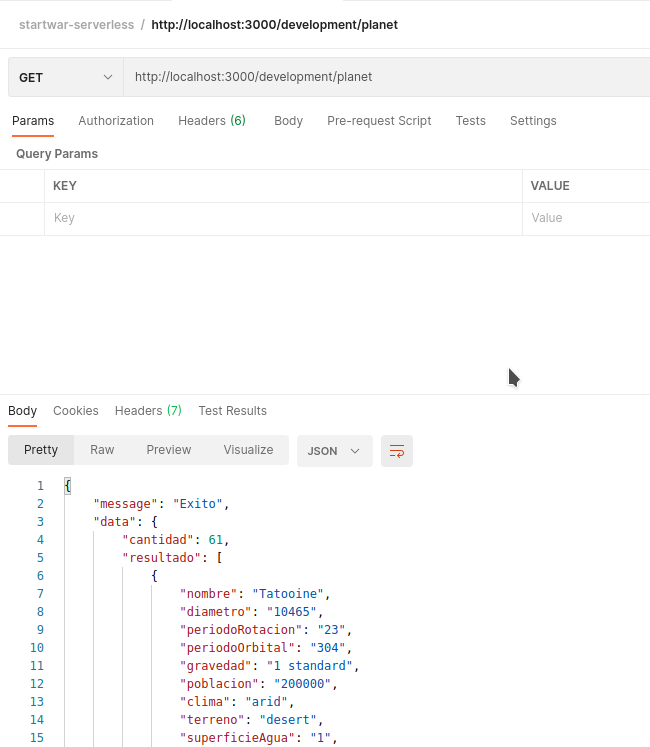

# startwar-serverless
	
## Requirements

* Crear una API en Node.js con el framework Serverless para un despliegue en AWS.  
* Adaptar y transformar los modelos de la API de prueba. Se tienen que mapear todos los nombres de atributos modelos del inglés al español (Ej: name -> nombre).  
* Integrar la API de prueba StarWars API (líneas abajo está el link) se deben integrar uno o más endpoints.  
* Crear un modelo de su elección mediante el uso de un endpoint POST, la data se tendrá que almacenar dentro de una base de datos.  
* Crear un endpoint GET que muestre la data almacenada.  
API de prueba SWAPI: [https://swapi.py4e.com/documentation](https://swapi.py4e.com/documentation)  

## Enviroment requirement
	
	node v12
	npm

    AWS dynamoDB

## Install

Before to install you must be create your AWS account : [https://aws.amazon.com/](https://www.serverless.com/framework/docs/providers/aws/guide/credentials/)

    $ git clone project
    $ cd project
    $ npm install

## Running the app

    $ npm start

## Test

    $ npm test

## Deploy the app
	
    $ sls deploy

## Others

If you need use POSTMAN for create more elemenst use our collection. it was created in: `README/POSTMAN/` directory [download here](README/POSTMAN/startwar-serverless.postman_collection.json)

## Img reference

